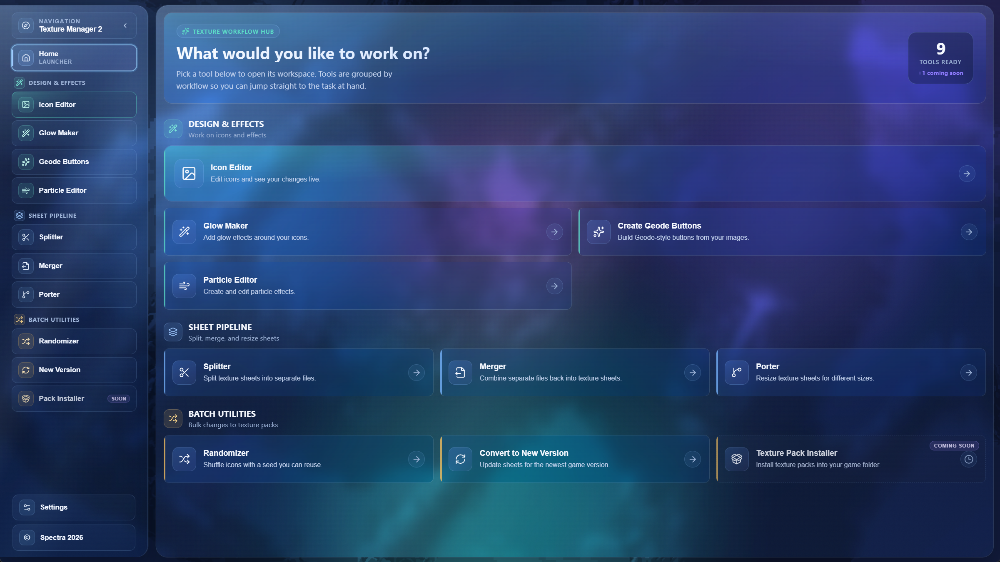
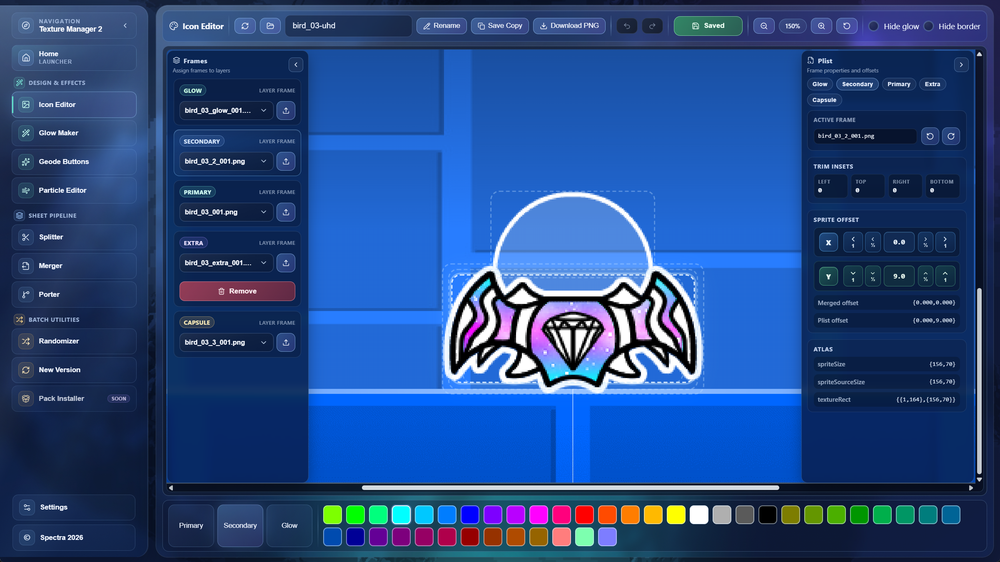
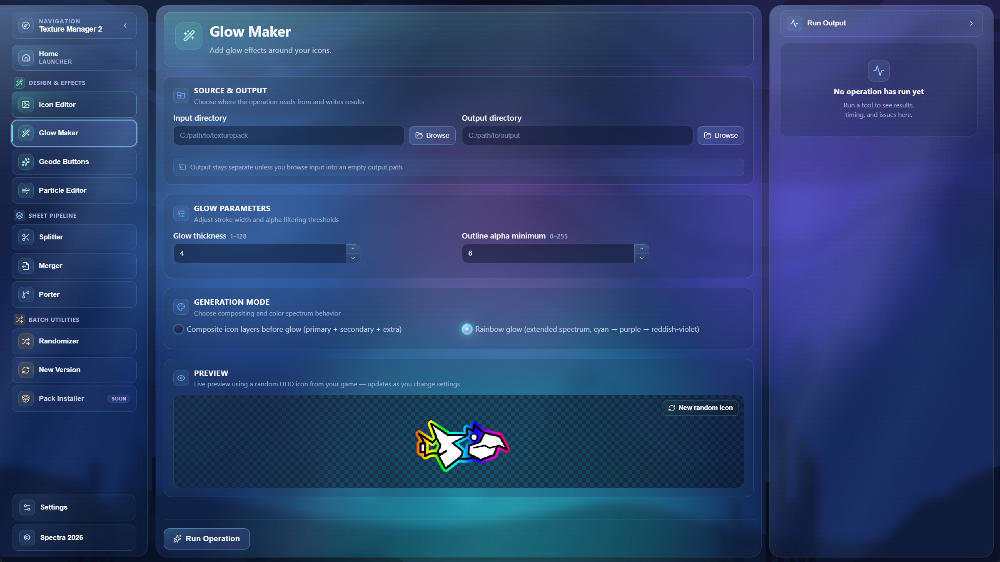
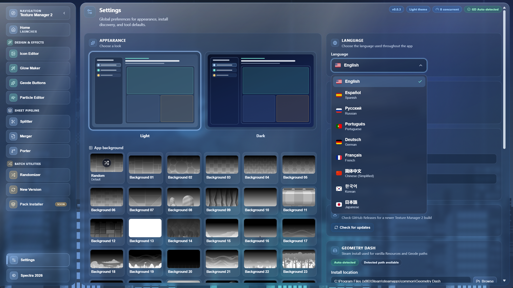

<p align="center">
  
</p>

# Texture Manager 2

**Geometry Dash texture tooling** — edit icons, split and merge sheets, add glow, build Geode-style buttons, convert packs between game versions, and more.

Built by [Spectra](https://www.youtube.com/c/spectraa) · [Discord](https://discord.gg/YFXhJZJCv6) · [GitHub](https://github.com/lspectraa/Texture-Manager-2)

---

<p align="center">
  
</p>

<p align="center">
  
</p>

---

## Features

| Area | Tools |
| --- | --- |
| **Design & Effects** | Icon Editor · Glow Maker · Geode Buttons · Particle Editor |
| **Sheet Pipeline** | Splitter · Merger · Porter |
| **Batch Utilities** | Randomizer · Convert to New Version · *(Texture Pack Installer — coming soon)* |

- First-run onboarding for language, theme, and Geometry Dash path
- Dark / light themes and optional Geometry Dash background art
- Multi-language UI
- Progress reporting with warnings and errors you can export
- Automatic updates from GitHub Releases (installed builds)

<p align="center">
  
</p>

<p align="center">
  
</p>

---

## Get started (app users)

### Requirements

- **Windows** x64 (MSI installer)
- **Geometry Dash** installed via Steam (recommended for auto-detect and game file tools)

### Install

1. Open the latest [GitHub Release](https://github.com/lspectraa/Texture-Manager-2/releases/latest).
2. Download the **`.msi`** installer (not the `.sig` or `latest.json`).
3. Run the installer and launch **Texture Manager 2**.
4. Complete onboarding:
   - Choose language
   - Pick light or dark theme
   - Confirm or browse to your Geometry Dash folder

After that, use **Home** to open a tool, set input/output folders, and run the operation.

### Updates

Installed copies can check for updates from Settings (**Check for updates**) or via the update banner when a newer release is published. Finish any running operation before installing an update — the app must restart to apply it.

---

## Get started (developers)

Stack: **Tauri 2** · **React 19** · **TypeScript** · **Vite 7** · **Rust**

### Prerequisites

| Tool | Notes |
| --- | --- |
| **Node.js 24+** | See `.nvmrc` |
| **npm** | Comes with Node |
| **Rust** (rustup) | Stable toolchain |
| **Windows** | MSI builds use WiX (Tauri downloads it as needed) |

Check what’s installed:

```powershell
npm run check:env
```

### Setup

```powershell
git clone https://github.com/lspectraa/Texture-Manager-2.git
cd Texture-Manager-2
npm install
```

### Develop

```powershell
npm run tauri dev
```

This starts the Vite frontend and opens the native Tauri window.

### Common scripts

| Command | Purpose |
| --- | --- |
| `npm run tauri dev` | Run the desktop app in development |
| `npm run build` | Typecheck + Vite production build |
| `npm test` | Unit tests (Vitest) |
| `npm run test:e2e` | Playwright e2e tests |
| `npm run sync:version` | Copy `package.json` version → Cargo / Tauri config |
| `npm run tauri build` | Release MSI (+ updater signature if signing env is set) |

### Versioning

**Single source of truth:** `package.json` → `"version"`.

Bump that field, then run `npm run sync:version` (also runs automatically on Tauri build).

### Release builds (local)

Updater artifacts need your private signing key:

```powershell
$env:TAURI_SIGNING_PRIVATE_KEY = (Get-Content "$env:USERPROFILE\.tauri\texture-manager-2.key" -Raw).Trim()
$env:TAURI_SIGNING_PRIVATE_KEY_PASSWORD = ""
npm run tauri build
```

CI publishes draft Windows MSI releases via `.github/workflows/publish.yml` when you push a `v*` tag or run the workflow manually.

### Project layout

```text
src/                 React UI, tools, i18n, services
src-tauri/           Rust backend, Tauri config, capabilities
scripts/             Prerequisites, version sync, updater key helper
.github/workflows/   Publish / release pipeline
docs/screenshots/    README screenshots
```

---

## Community

- [YouTube — Spectra](https://www.youtube.com/c/spectraa)
- [Discord](https://discord.gg/YFXhJZJCv6)
- [Issues](https://github.com/lspectraa/Texture-Manager-2/issues)

---

## License

This project is licensed under the [GNU General Public License v3.0 or later](LICENSE).

You can redistribute it and/or modify it under the terms of the GPL. See `LICENSE` for the full text.

The AI upscaler bundles third-party inference binaries and model weights. Those stay under their own licenses; Texture Manager 2 does not relicense them. Full copyright notices and license texts ship with the app in `src-tauri/resources/upscaler/NOTICE` (also linked from About):

- **Waifu2x** (nagadomi) and **waifu2x-ncnn-vulkan** (nihui) — MIT
- **Real-ESRGAN** / `realesr-animevideov3` (Xintao Wang) — BSD-3-Clause
- **Real-ESRGAN ncnn Vulkan** (Xintao Wang / nihui) — MIT
- **ncnn** (Tencent) — BSD-3-Clause

© Spectra 2026
