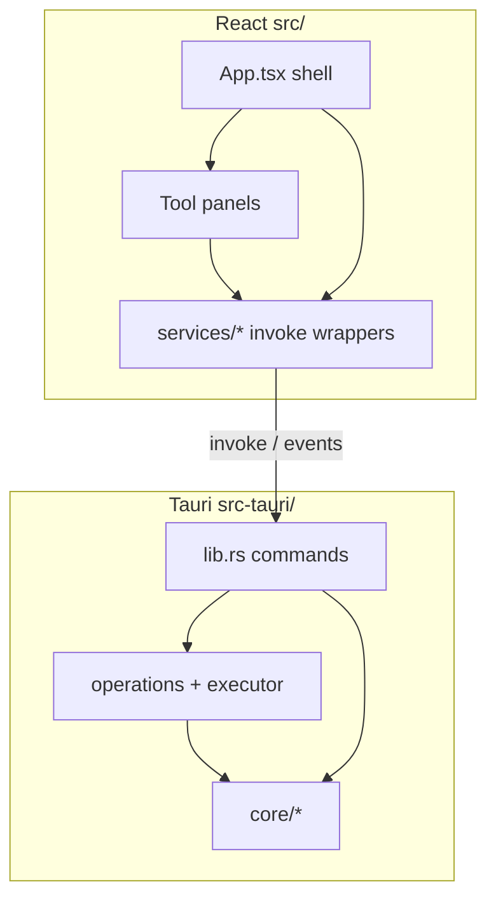
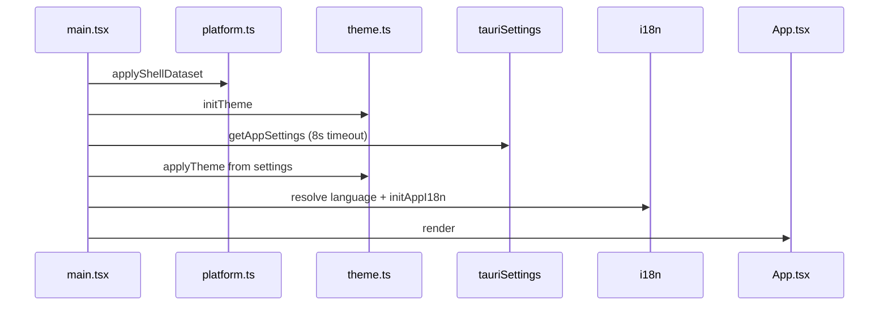
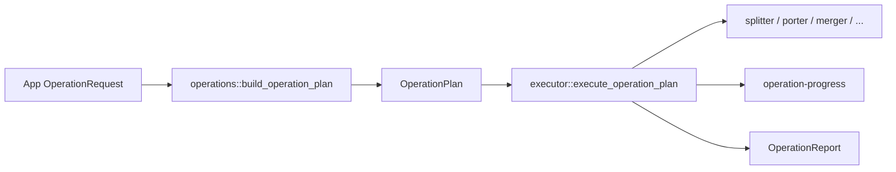
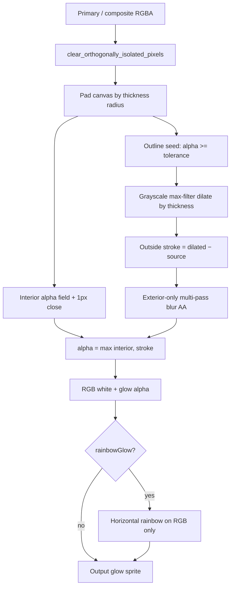
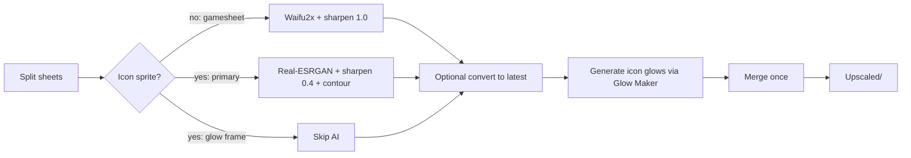
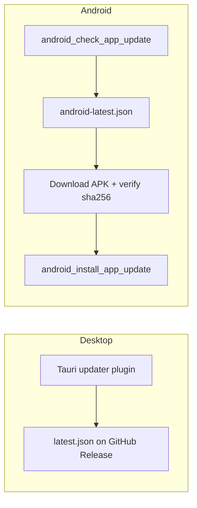

# Architecture and Systems

Comprehensive guide to Texture Manager 2 internal systems, pipelines, and architecture.

---

## 1. System Layers & Execution Styles

Texture Manager 2 uses two distinct execution patterns:

1. **Batch Pipeline (`run_operation`)**:
   - Shared folder-in / folder-out jobs.
   - App builds an `OperationRequest` DTO $\rightarrow$ `run_operation` $\rightarrow$ emits `operation-progress` events $\rightarrow$ returns `OperationReport` displayed in the report rail.
   - Used by Splitter, Merger, Porter, Upscaler (desktop-only), Randomizer, Convert to New Version (desktop-only), and Glow Maker batch mode.
2. **Dedicated Commands**:
   - Interactive or specialized panels invoke dedicated Tauri commands directly (e.g., Icon Editor, Particle Editor, Pack Installer).
   - Pack Installer emits its own `pack-install-progress` event and manages its own right-rail metadata/library state.
3. **Hybrid**:
   - Geode Buttons: panel owns template indexing and preview generation via dedicated commands; final texture generation delegates to the shared batch `run_operation` engine (with `showOperationAndReport` hidden in the UI).

### Desktop vs. Android Runtime

| Concern | Desktop (macOS/Win/Linux) | Android |
| --- | --- | --- |
| Heavy AI tools (Upscaler, Convert) | Enabled (Vulkan sidecars / Resources) | Rejected in executor; omitted from UI |
| App Updater | Tauri updater plugin + `latest.json` | APK download + `android-latest.json` |
| Geometry Dash path | Steam install + vanilla `Resources` | Geode media (`.../com.geode.launcher/game`) |
| File Pickers | Native dialog plugin (`tauriPicker.ts`) | Android SAF (`android_pick_*`) |
| Upscaler Sidecars | Bundled Vulkan binaries (`ncnn`) | Not shipped or executed |

### Core Frontend Events

| Event | Payload | Purpose |
| --- | --- | --- |
| `operation-progress` | `OperationProgress` | Batch operation progress overlay |
| `pack-install-progress` | `PackInstallProgress` | Pack installer and library operation tracking |
| `android-update-download-progress` | Download stats | Android APK download indicator |

---

## 2. Frontend Shell & Navigation

`src/App.tsx` owns the application lifecycle: tool selection, batch execution, progress overlay, report rail, settings hydration, onboarding gate, update banner, and mobile history.

### Boot Sequence

- `isMobileShell()` returns true when running in Android WebView UA or when `?shell=mobile` query param is present. Applies `document.documentElement.dataset.shell = "mobile"`.
- **Render Phases**:
  1. Boot: Background only until `settingsHydrated`.
  2. Onboarding: Full-screen `OnboardingFlow` displayed if stored onboarding version is lower than required (desktop 1, mobile 2).
  3. Main Shell: Background (`.tm-bg` with `AppGameBackground`), optional update banner, sidebar/dock, and active tool view.

### Navigation and History

- Navigation catalog: `src/config/toolNavigation.ts` (`TOOL_NAV_SECTIONS`, `AppToolId`).
- Surfaces: Desktop `AppSidebar.tsx`, Mobile dock `MobileBottomDock.tsx`, Mobile drawer `MobileSideDrawer.tsx`.
- Mobile history states: `history.state.tm`: `grid` | `tool` | `drawer` | `shell`. Navigating from an open grid replaces state (`history.replaceState`) so Back does not get stuck in a loop. `src/utils/mobileHistory.ts` suppresses nested `popstate` races.

### Internationalization (i18n)

- Namespaces: `common`, `navigation`, `onboarding`, `settings`, `tools`, `iconEditor`, `reports`, `errors`.
- Supported languages: `en` (source) + `es`, `ru`, `pt`, `de`, `fr`, `zh`, `ko`, `ja`, `vi`.
- Rust `SUPPORTED_LANGUAGES` in `src-tauri/src/core/settings.rs` must stay in sync with frontend catalogs.

---

## 3. Batch Pipeline

All batch folder operations follow a unified request $\rightarrow$ plan $\rightarrow$ execute lifecycle:

### Operation Kinds (`OperationKind`, camelCase on wire)

| Kind | UI Tool ID | Handler / Purpose | Default Output |
| --- | --- | --- | --- |
| `splitter` | `splitter` | Splits atlas sheets into individual frame PNGs + plist | `Split/` |
| `porterSplitter` | `porter` | Scales and renames sheets across graphics tiers (UHD/HD/Low) | `Ported/` |
| `merger` | `merger` | Packs individual frames into a compact atlas + plist | `Merged/` |
| `convertToNewVersion` | `convertToNewVersion` | Aligns legacy packs to current game frames using Resources | `ConvertedToLatestVersion/` |
| `randomizer` | `randomizer` | Seeded icon sheet shuffle | `Randomized/` |
| `glowMaker` | `glowMaker` | Batch generates missing `_glow_*` frames | `GeneratedGlow/` |
| `geodeButtons` | `geodeButtons` | Recolor Geode button sprite families with HSV adjustments | Tool output dir |
| `upscaler` | `upscaler` | AI upscale pipeline with sidecars (desktop only) | `Upscaled/` |

- **Concurrency**: Upscaler concurrency is strictly clamped to `1`. Other operations clamp sheet concurrency between 1 and 64 (default `5` from settings).
- **Cancellation**: Managed via `OperationCancel(AtomicBool)`. `cancel_operation` triggers the flag; workers check the flag and abort with `AppError::Cancelled`.

---

## 4. Interactive Editors

### Icon Editor
- **Files**: `src/components/tools/IconEditorToolPanel.tsx`, `src/services/tauriIconEditor.ts`, `src-tauri/src/core/icon_editor.rs`.
- **Capabilities**: Sheet inspector, frame add/import/rotate, frame extraction, stem renaming, swap renames, in-memory history undo/redo (`iconEditorHistory.ts`), and real-time glow generation via `generate_icon_glow_cmd`.

### Particle Editor
- **Files**: `src/components/tools/ParticleEditorToolPanel.tsx`, `src/services/tauriParticleEditor.ts`, `src-tauri/src/core/particle_editor.rs`.
- **Capabilities**: Opens/saves Cocos particle `.plist` files, canvas simulator in JS, loads GD particle presets (`gdParticleEffects.ts`), in-memory undo/redo (`particleEditorHistory.ts`), and texture previews from Rust.

### Geode Buttons (Hybrid)
- **Files**: `src/components/tools/GeodeButtonsToolPanel.tsx`, `src/services/tauriGeodeButtons.ts`, `src-tauri/src/core/geode_buttons.rs`.
- Resolves BlankSheet templates from GD `Resources` or Android Geode media. Generates HSV family variations. On Android, prefers Geode media over split-cache.

---

## 5. Glow Generation Pipeline

Glow Maker generates Photoshop-style outside stroke glows from primary icon silhouettes:

- **Composite Silhouettes (`glow_composite`)**: Stacks secondary (`{stem}_2_001`), primary (`{stem}_001`), and extra (`{stem}_extra_001`) layers according to plist offsets before stroking.
- **Outside Stroke Rendering**: Interior is filled solid white (RGB 255) with existing alpha; dilation produces outside stroke without bleeding onto inner edges.
- **Tier Scaling**: UI thickness represents UHD scale; automatically scaled to ~½ for HD and ~¼ for Low.

---

## 6. Upscaler Architecture (Desktop-Only)

Dual-engine AI pipeline tailored for Geometry Dash sprite assets:

- **Dual-Engine Routing**:
  - Gamesheets/non-icons: Waifu2x (CUNet). Full unsharp sharpen (1.0), no contour smoothing.
  - Icon primaries/parts: Real-ESRGAN (AnimeVideo v3). Gentle sharpen (0.4) + Laplacian contour smoothing with 1px antialiasing.
  - Icon glow frames (`*_glow_*`): **Never AI upscaled**. Completely regenerated from upscaled primaries using the Glow Maker algorithm.
- **Post-AI Finish (`image_finish.rs`)**:
  1. Isolated pixel cleanup: removes 4-disconnected single pixels and noise.
  2. Sharpening: edge-weighted 2-pass RGB unsharp; true black is darken-only to preserve crisp ink outlines.
  3. Contour smoothing (`smooth_ink_contour`): Laplacian polygon smoothing with locked sharp corners (~55°) to eliminate pixelation steps.
- **Binaries & Resources**: `waifu2x-ncnn-vulkan` and `realesrgan-ncnn-vulkan` fetched via `npm run fetch:upscaler-binaries`. Clamped to concurrency 1.
- **Sprite Index Reuse**: Exact SHA-256 and perceptual similarity caching (`sprite_index.rs`) prevents re-upscaling previously processed sprites.

---

## 7. Pack Installer & Geode Integration

Dedicated texture pack discovery, installation, and order manager:

- **Flow**: `discover_pack_install` $\rightarrow$ `InstallPlan` $\rightarrow$ `install_pack_plan`.
- **Destination Roots**:
  - Packs $\rightarrow$ `{GD}/geode/config/geode.texture-loader/packs/{folder}`
  - Mod configs $\rightarrow$ `{GD}/geode/config/{name}`
  - Mods $\rightarrow$ `{GD}/geode/mods/{file}.geode`
- **Applied Order Management**:
  - Reads and writes `{save_dir}/geode/mods/geode.texture-loader/saved.json` (`applied[].path`).
  - Save directories: Windows `%LOCALAPPDATA%/GeometryDash`, macOS `~/Library/Application Support/GeometryDash`, Linux `~/.local/share/GeometryDash`, Android `/storage/emulated/0/Android/media/com.geode.launcher/save`.
- **Library CRUD**: `list_installed_packs`, `create_texture_pack`, `read_pack_metadata`, `update_installed_pack_metadata`, `delete_installed_pack`.

---

## 8. Mobile & Android Subsystem

- **Storage Architecture**: Android requires All-Files access (`MANAGE_EXTERNAL_STORAGE`) to read the Geode media folder: `/storage/emulated/0/Android/media/com.geode.launcher/game`.
- **SAF & Sandbox FS (`core/mobile_fs.rs`)**:
  - File picker returns SAF URIs which are resolved to real paths or imported into app-scoped sandbox: `{game-files}/imports/{timestamp}-{name}`.
  - Output directories allocated dynamically: `{game-files}/outputs/{toolId}/{timestamp}`.
  - Export: Zip compression service allows sharing/exporting outputs directly from the report rail.

---

## 9. Dual-Channel App Updater

- **Desktop**: Managed by `@tauri-apps/plugin-updater`. Manifest: `latest.json`. Signed with `TAURI_SIGNING_PRIVATE_KEY`.
- **Android**: Managed in Rust by `android_apk_update.rs` + Kotlin plugin. Manifest: `android-latest.json`. Downloads APK with hash verification and hands off to OS package installer.
- **Simulation**: `?simulateUpdate=1` or `localStorage.tmSimulateUpdate = "1"` triggers fake update workflow for UI verification.

---

## 10. Game Files Layout, Settings & Capabilities

### Layout Structure
- `root`: App data directory (`~/TextureManager2/game-files` or Android app files; configurable via `TM_GAME_FILES_DIR`).
- `geometry_dash_dir`: Steam GD install or Android Geode `game/`.
- `resources`: Vanilla game resources (`Resources/`).
- `geode_*`: `{GD}/geode/{resources,unzipped,config,mods}`.
- `texture_loader_packs`: `{GD}/geode/config/geode.texture-loader/packs`.
- `current_split`: `{root}/split-cache`.
- `settings.json`: Persisted via `core/settings.rs` (`geometryDashDir`, `defaultSheetConcurrency`, `theme`, `language`, `appBackground`, `appBackgroundOpacity`, `onboardingVersion`).
- `sprite-index.json`: Sprite hash index for Upscaler deduplication.

### Tauri Capabilities and Permissions
- `capabilities/default.json`: Core commands, dialog, opener restricted to official links (GitHub/YouTube/Discord).
- `capabilities/desktop.json`: Desktop updater and process execution permissions.
- `capabilities/mobile.json`: Android-specific scoped permissions.
