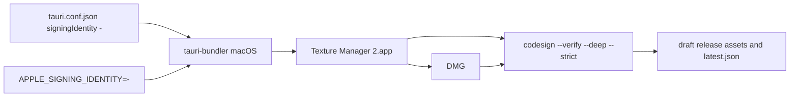

# Publish and release

Source of truth: `.github/workflows/publish.yml`. Triggers: push tag `v*`, or `workflow_dispatch`.

## Jobs

| Job | Runner | Output |
| --- | --- | --- |
| `publish-tauri` | Windows + macOS matrix | MSI; DMG arm64; DMG x64; draft GitHub release; desktop updater JSON |
| `publish-android` | Ubuntu | arm64 APK + `android-latest.json` |

Desktop job runs `npm ci` → `sync:version` → `fetch-upscaler-binaries`, then `tauri-apps/tauri-action@v0` with `includeUpdaterJson: true`.

Windows uses one action invocation that builds and uploads, including `latest.json`. macOS uses two action invocations. The first omits `tagName`, `releaseName`, and `releaseId`, which is how v0.6.2 builds without uploading (it has no upload-only input). The existing `codesign` step then mounts the DMG. Only if that step succeeds does a second invocation upload, with `tauriScript: bash .github/scripts/skip-tauri-rebuild.sh` so v0 does not rebuild, and with `includeUpdaterJson: false`. That upload uses the action's asset names and release create-or-update for the verified DMG, `.app.tar.gz`, and `.sig`. `.github/scripts/merge-macos-latest-json.mjs` then writes `latest.json`.

On macOS only, CI sets `APPLE_SIGNING_IDENTITY=-` before those steps. `bundle.macOS.signingIdentity` in `src-tauri/tauri.conf.json` is also `"-"`, so local `tauri build` on a Mac ad-hoc signs the same way. `APPLE_SIGNING_IDENTITY` overrides the config value when a real Developer ID is supplied later. Windows and Android jobs do not set it.

Android job builds with `npx tauri android build` (skips the npm `tauri` wrapper that auto-fetches upscaler binaries — intentional; Android has no upscaler sidecars).

## Version bump local sequence

1. Bump `"version"` in root `package.json`.
2. `npm run sync:version` (also runs on Tauri build).
3. Tag `vX.Y.Z` and push, or run the workflow manually.
4. Human publishes the draft release after checking artifacts.

## Signing notes (names only)

- Desktop updater: `TAURI_SIGNING_PRIVATE_KEY`. Do **not** set `TAURI_SIGNING_PRIVATE_KEY_PASSWORD` in GitHub — empty secrets are rejected, and a non-empty password breaks a passwordless key.
- macOS bundle: ad-hoc identity `-` (no Apple certificate). Hardened runtime stays at Tauri's default (`true`). After the DMG is built, and before anything is uploaded, the macOS matrix rows run `codesign --verify --deep --strict --verbose=2` on any loose `bundle/macos/*.app` and on the `.app` inside the DMG. A missing DMG or a broken signature fails the job. The upload step is guarded with `success()`, so that failure does not upload the DMG, the updater archive, or `latest.json`.
- Desktop `latest.json`: Windows still lets tauri-action `uploadVersionJSON` download the current file, keep `platforms`, and set `windows-x86_64` plus `windows-x86_64-msi` from the MSI signature. macOS does not use that path. After the verified assets are uploaded, `merge-macos-latest-json.mjs` waits until `windows-x86_64` is in the release file, then sets `darwin-aarch64` or `darwin-x86_64` and `darwin-<arch>-app` from the `.app.tar.gz` asset URL and the local `.sig`. It retries if a later read is missing those keys or the Windows keys it merged. The wait fails the job if the Windows MSI has been on the release for five minutes with no updater JSON, or if `windows-x86_64` is still absent after 90 minutes. Updater download URLs rewrite `untagged-*` to the `v` tag, matching the action. After a publish, confirm the draft contains `windows-x86_64`, `darwin-aarch64`, and `darwin-x86_64`.
- Without that identity, `tauri-bundler` skips signing the `.app`. The Mach-O is only linker-signed, so the bundle has no sealed `CodeResources`. On Apple Silicon, Gatekeeper then reports the quarantined app as damaged (issue #7).
- Ad-hoc signing is not notarization. Users typically get the unidentified-developer prompt (right-click → Open, or Privacy & Security → Open Anyway). `xattr -cr` on the installed `.app` remains the fallback when macOS still says the app is damaged. That note is in the README and in the release notes (`releaseBody` on the Windows build step and the macOS upload step, and the Android `NOTES` block, which also feeds `android-latest.json`).
- Tagged Android publish requires `ANDROID_KEYSTORE_BASE64`, `ANDROID_KEY_ALIAS`, `ANDROID_KEYSTORE_PASSWORD`. Manual dispatch may fall back to debug-signed APK when those are absent.
- Developer ID + notarization is not configured. Do not add `APPLE_CERTIFICATE`, `APPLE_CERTIFICATE_PASSWORD`, `APPLE_ID`, `APPLE_PASSWORD`, `APPLE_TEAM_ID`, or App Store Connect API key secrets until the owner enrolls in the Apple Developer Program.

## User-facing installers

Ship `.msi` / `.dmg` / `.apk`. Do not tell users to install `.sig`, `latest.json`, or `android-latest.json`.
