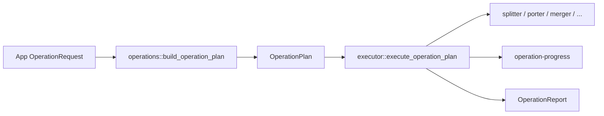

# Batch pipeline

Shared folder-in / folder-out jobs go through `run_operation`.

## Request → plan → execute



| Piece | Path |
| --- | --- |
| Frontend types | `src/domain/operations.ts` |
| Invoke | `src/services/tauriOperations.ts` — `get_phase_defaults`, `run_operation`, `cancel_operation` |
| Validate / clamp | `src-tauri/src/core/operations.rs` |
| Contracts | `src-tauri/src/core/contracts.rs` |
| Dispatch | `src-tauri/src/core/executor.rs` |
| Progress / report | `src-tauri/src/core/report.rs` |

Upscaler concurrency is forced to **1**. Other kinds typically clamp sheet concurrency 1–64 (settings default 5).

## Kinds (`OperationKind`, camelCase on the wire)

| Kind | UI tool id | Handler (high level) | Typical output folder |
| --- | --- | --- | --- |
| `splitter` | `splitter` | Atlas → frame PNGs | `Split/` |
| `porterSplitter` | `porter` | Scale/rename by graphics tier | `Ported/` |
| `merger` | `merger` | Frames → sheet + plist | `Merged/` |
| `convertToNewVersion` | `convertToNewVersion` | Align pack to current GD frames | `ConvertedToLatestVersion/` |
| `randomizer` | `randomizer` | Seeded icon shuffle | `Randomized/` |
| `glowMaker` | `glowMaker` | Generate missing `_glow_*` frames | `GeneratedGlow/` |
| `geodeButtons` | `geodeButtons` | HSV-recolor Geode button families | (tool output dir) |
| `upscaler` | `upscaler` | AI upscale pipeline | `Upscaled/` |

**Android hard-rejects** before dispatch: `upscaler`, `convertToNewVersion`.

Discovery skips reserved output dir names (`Split`, `Merged`, `Ported`, `GeneratedGlow`, `ConvertedToLatestVersion`, `Randomized`, `Upscaled`) — see `core/discovery.rs`.

## Cancel

- Managed state: `OperationCancel(AtomicBool)`
- `cancel_operation` sets the flag; `run_operation` clears it at start
- Workers poll → `AppError::Cancelled`
- Pack Installer’s nested ops use a **local** cancel flag (not the shared UI cancel)

## Progress shape

```text
OperationProgress {
  gamesheetName, spritesCompleted, spritesTotal,
  plistsCompleted, plistsTotal
}
```

Emitted as Tauri event `operation-progress`.

## Supporting core modules

| Module | Role |
| --- | --- |
| `discovery` | Find plist/png pairs, standalone PNG/FNT |
| `plist` / `pipeline` | Plist I/O and sheet geometry helpers |
| `image_io` / `image_alpha` / `image_finish` | PNG I/O and finish policies |
| `safe_fs` | Absolute paths, root containment |

Phase defaults (`get_phase_defaults`) seed UI defaults for batch tools from Rust.
