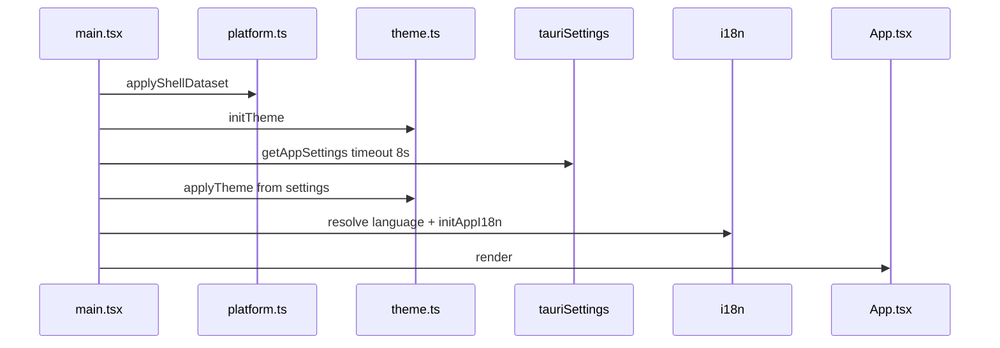
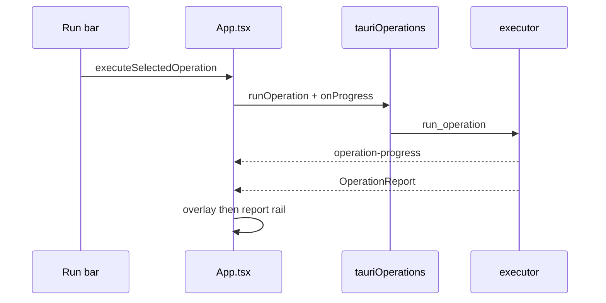

# Frontend shell

`src/App.tsx` owns the running shell: tool selection, batch Run, progress/report, settings hydrate, onboarding gate, update banner, and mobile history. Panels under `src/components/tools/` are mostly controlled or self-contained.

## Boot

`isMobileShell()` is true on Android UA or `?shell=mobile`. Dataset: `document.documentElement.dataset.shell`.

## Render phases

1. Boot (background only) until `settingsHydrated`
2. Full-screen `OnboardingFlow` if onboarding version &lt; required (desktop 1 / mobile 2)
3. Main shell: `AppGameBackground` + optional `AppUpdateBanner` + layout

## Navigation

Catalog: `src/config/toolNavigation.ts` (`TOOL_NAV_SECTIONS`, `AppToolId`).

| Surface | Path |
| --- | --- |
| Home | `HomeScreen.tsx` |
| Desktop | `AppSidebar.tsx` |
| Mobile dock / grid | `mobile/MobileBottomDock.tsx` |
| Mobile drawer | `mobile/MobileSideDrawer.tsx` (hosts report / pack rail) |

`navigateTool` blocks upcoming and desktop-only tools on mobile. About: desktop opens `CopyrightDialog`; mobile selects tool `about`.

### Mobile history

`history.state.tm`: `grid` | `tool` | `drawer` | `shell`. Navigating from an open grid uses `replaceState` so Back does not reopen the grid. `src/utils/mobileHistory.ts` suppresses nested `popstate` races.

## Batch vs dedicated wiring

| Flag / path | Meaning |
| --- | --- |
| `showRunAction` | Tool panel except pack installer — App footer Run |
| `showOperationAndReport` | Batch tools that use the shared report rail (excludes icon, particle, geode, pack, shell pages) |
| `showPackMetadataRail` | Pack Installer only |

Batch form state (dirs, options) is lifted into `App.tsx`. Dedicated tools keep state in their panels.

## Progress and report

- Overlay while `isRunning`; cancel → `cancel_operation`
- Report rail: issues grouped by `reportIssuesCsv.ts`; copy/download CSV; mobile can zip-export output
- Paths in UI/errors redacted via `pathDisplay.ts`

## Settings and backgrounds

`SettingsToolPanel` → `runSettingsAction` / `save_app_settings`. Background opacity is debounced (~180ms) with `applyResult: false` so slider responses do not snap backward.

## Shared tool chrome

`src/components/tools/layout/*`: `ToolPage`, paths section (mobile can `allocate_output_dir`), fields, `ToolActionBar` / glass buttons.

## i18n

Namespaces: `common`, `navigation`, `onboarding`, `settings`, `tools`, `iconEditor`, `reports`, `errors`.  
Languages: en (source) + es, ru, pt, de, fr, zh, ko, ja, vi. Non-en show `TranslationQualityNotice`. Rust `SUPPORTED_LANGUAGES` must stay in sync (`src/i18n/CONTRIBUTING.md`).
