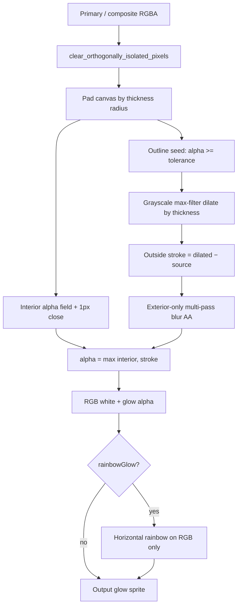

# Glow Maker — glow generation pipeline

Batch tool (`glowMaker` → `run_operation`) plus live preview. Shared render core is also used by the Upscaler icon-glow step and Icon Editor generated glow. Catalog: [[tools]]; shell: [[batch-pipeline]].

| Layer          | Path                                                               |
| -------------- | ------------------------------------------------------------------ |
| Panel          | `GlowMakerToolPanel.tsx`                                           |
| Preview        | `tauriGlowMaker.ts` → `glow_maker_preview_cmd` (`glow_preview.rs`) |
| Batch          | `glow_maker::execute_glow_maker`                                   |
| Render         | `glow::render_icon_glow_from_primary`                              |
| Composite      | `glow_composite::composite_icon_layers_for_glow`                   |
| Domain options | `GlowMakerOptions` in `domain/operations.ts` / `contracts.rs`      |

## Batch flow

```mermaid
flowchart LR
  In[icons/ input] --> Discover[Discover icon sheets]
  Discover --> Split[split_sheet_candidate_memory]
  Split --> Iso[clear_orthogonally_isolated_pixels on every sprite]
  Iso --> Loop[For each *_glow_* frame]
  Loop --> Prim[Resolve primary via glow_primary_name_for]
  Prim --> Src{compositeLayers?}
  Src -->|yes| Comp[composite_icon_layers_for_glow]
  Src -->|no| PrimOnly[Primary sprite alone]
  Comp --> Render[render_icon_glow_from_primary]
  PrimOnly --> Render
  Render --> Replace[Replace glow sprite in memory]
  Replace --> Merge[merge_plist_from_memory]
  Merge --> Out[icons/GeneratedGlow/]
```

### Inputs / outputs

- Input must be an `icons` folder, or a parent that contains `icons/`.
- Output: `GeneratedGlow/` under the output icons tree (`output/icons/GeneratedGlow` or `output/GeneratedGlow` if output itself is `icons`).
- Discovers sheets under that icons tree (phase-default splitter options; merger includes outside-plist files as needed by `execute_glow_maker`).

### Per-sheet processing (`glow_maker_process_one_sheet_candidate`)

1. Split sheet into in-memory sprites + plist.
2. Run isolated-pixel cleanup on **every** extracted sprite (same helper as upscaler finish).
3. For each frame whose name contains `_glow_`:
  - Resolve primary with `glow_primary_name_for` (`foo_glow_001.png` → `foo_001.png`, or strip `_glow_` infix).
  - If primary missing → warning, skip that glow.
  - If `compositeLayers`: build multi-layer silhouette; on failure/None → warning + primary alone.
  - **Discard** the original glow texture entirely; insert freshly rendered glow.
4. Merge atlas + write plist/png under `GeneratedGlow/`.
5. Thickness is scaled per sheet tier before render (`glow_maker_options_for_stem`): UI thickness is **UHD-equivalent**; HD uses ~½, Low ~¼ (`glow_thickness_for_tier`), clamped 1–128.

Only frames that already have a `_glow_` slot in the sheet are regenerated. Primaries without a glow frame are left alone (no new glow keys invented).

## Layer composite (`glow_composite`)

When `compositeLayers` is on, glow is generated from a stacked silhouette, not a single piece.

Draw order (`COMPOSITE_LAYER_ORDER`):

1. Secondary — `{stem}_2_001`
2. Primary — `{stem}_001`
3. Extra — `{stem}_extra_001`

Stem from `icon_stem_from_frame_name` (same rules as Icon Editor: `player_12_001`, `_2_001`, `_extra_001`, `_glow_001`, …).

Layers are positioned using plist frame offsets relative to the primary, then alpha-overlaid onto a tight canvas. If only one layer exists, composite returns “use primary”. Multi-part icons (bird capsule + dome, robot pieces, etc.) get one outline around the combined shape.

Upscaler’s icon-glow path always sets `composite_layers: true`. Glow Maker exposes it as a checkbox.

## Core render (`render_icon_glow_from_primary`)

Photoshop-style **outside stroke** from primary (or composite) alpha — original glow pixels are never read.

| Option            | Meaning                                                                                                                                                               |
| ----------------- | --------------------------------------------------------------------------------------------------------------------------------------------------------------------- |
| `thickness`       | Stroke radius in **native** pixels after tier scale (UI is UHD-equivalent for batch Glow Maker; Upscaler passes thickness through its own options — see [[upscaler]]) |
| `tolerance`       | Minimum alpha for the **outline seed** (0–255). Faint fringe below this is ignored so debris does not grow the stroke                                                 |
| `rainbowGlow`     | Recolor white glow with a fixed multi-stop horizontal rainbow; alpha unchanged                                                                                        |
| `compositeLayers` | Stack secondary/primary/extra before stroke                                                                                                                           |
| `dimensions`      | Present on the options DTO (merger/port-style override); batch path uses phase merger defaults for atlas size                                                         |

Interior is fully whitened (RGB 255) under the silhouette; stroke softens only **outside** so the fill does not seam against the outline.

## Preview vs batch

| Path         | Behavior                                                                                    |
| ------------ | ------------------------------------------------------------------------------------------- |
| Live preview | `glow_maker_preview_cmd` — random bundled preview icon or custom sheet; same render options |
| Icon Editor  | `generate_icon_glow_cmd` — glow from component/primary for the editor canvas                |
| Upscaler     | Same render + always-on composite; no rainbow; after AI finish                              |

## Pitfalls

- Expects an `icons` tree — gamesheet-only folders fail validation.
- Regenerates only existing `_glow_` frames; does not add glow slots.
- Tier scaling: the same UI thickness is thinner in native pixels on HD/Low sheets than on UHD.

