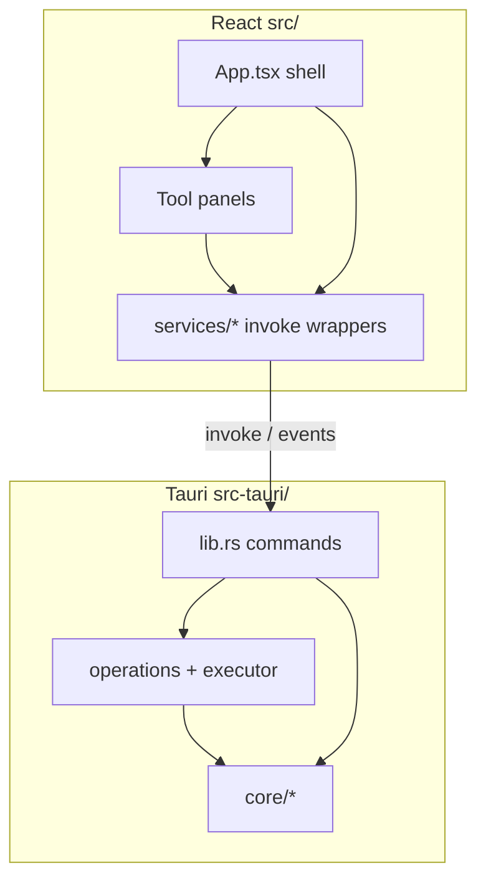

# Systems overview

How Texture Manager 2 is put together. Deeper notes live beside this file.

## Layers

| Layer | Owns | Start here |
| --- | --- | --- |
| Product flows | Tools, onboarding, platforms | [[purpose-and-flows]], [[tools]] |
| Frontend shell | Navigation, batch Run, report rail, mobile history | [[frontend-shell]] |
| Batch pipeline | `run_operation`, cancel, progress | [[batch-pipeline]] |
| Interactive editors | Icon, Particle, Geode Buttons | [[editors]] |
| Glow Maker | Batch glow gen + shared render core | [[glow-maker]] |
| Pack Installer | Discover/install/library/applied order | [[pack-installer]] |
| Game files + settings | Layout roots, `settings.json`, sprite index | [[game-files-and-settings]] |
| Mobile / Android | All-files, SAF, mobile_fs, APK update | [[mobile-android]] |
| Updater | Desktop plugin vs Android JSON | [[updater]] |
| Upscaler | Sidecars, icon finish, icon glow | [[upscaler]] |
| IPC cheat sheet | Service → command map | [[invoke-surface]] |
| Capabilities / plugins | Tauri permissions | [[capabilities]] |

## Two execution styles

1. **Batch** — App builds an `OperationRequest` → `run_operation` → `operation-progress` → `OperationReport` rail.
2. **Dedicated** — Panel calls its own commands (Icon Editor, Particle Editor, Pack Installer). Pack Installer uses `pack-install-progress`.

Geode Buttons is **hybrid**: preview/index dedicated; generate is batch Run.

## Desktop vs Android (quick)

| Concern | Desktop | Android |
| --- | --- | --- |
| Upscaler / Convert | Yes | Rejected in executor |
| Updater | Tauri plugin + `latest.json` | APK + `android-latest.json` |
| GD path | Steam install + Resources | Geode media `…/com.geode.launcher/game` |
| Pickers | Dialog plugin | SAF (`android_pick_*`) |
| Sidecars | Bundled ncnn | Not shipped |

## Events (frontend listens)

| Event | Payload use |
| --- | --- |
| `operation-progress` | Batch overlay |
| `pack-install-progress` | Pack Installer / library ops |
| `android-update-download-progress` | Android APK download |
