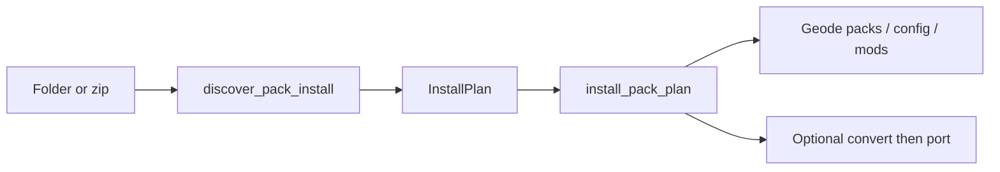

# Pack Installer

Dedicated tool (not the shared `run_operation` rail). Progress event: `pack-install-progress`.

| Layer | Path |
| --- | --- |
| Panel | `TexturePackInstallerToolPanel.tsx` |
| Metadata / applied rail | `PackInstallerMetadataSidebar.tsx` |
| Domain | `domain/packInstaller.ts`, `packMetadataValidation.ts` |
| Service | `tauriPackInstaller.ts` |
| Core | `core/pack_installer.rs`, `texture_loader_applied.rs` |

Modes: `install` | `create` | `library`. Bridge type `PackInstallerBridge` syncs panel ↔ App right rail.

## Discover → plan → install

1. Requires `geometry_dash_found`.
2. Zip extracts under `{game-files}/pack-install-temp/…` (clean up with `cleanup_pack_install_temp`).
3. Units: `pack` | `configTree` | `mod`
   - Packs → `…/geode/config/geode.texture-loader/packs/{folder}`
   - Config trees → `…/geode/config/{name}` (never installs `geode.texture-loader` config itself — packs only)
   - Mods → `…/geode/mods/{file}.geode`
4. Selected units copy; UI can override `pack.json` / `pack.png` after copy.
5. Optional post-steps per pack: Convert to Latest, then Port (overlay). **Convert refused on Android.**

## pack.json

Required non-empty: `textureldr`, `name`, `id`, `version`, `author`. Default scaffold `textureldr` `"1.5.0"`. Validation: `packMetadataValidation.ts`.

## Library CRUD

`list_installed_packs`, `create_texture_pack`, `read_pack_metadata`, `update_installed_pack_metadata`, `delete_installed_pack`, `pack_png_data_url_from_dir`.

Library ops: `run_pack_operation` with `convertToNewVersion` | `porterSplitter` | `splitter` (same progress event).

## Applied pack order

`texture_loader_applied` reads/writes Geode mod save:

`{save}/geode/mods/geode.texture-loader/saved.json` → `applied[].path`

Save roots (not the game install): Windows `%LOCALAPPDATA%/GeometryDash`, macOS App Support, Linux `~/.local/share`, Android `…/Android/media/com.geode.launcher/save`.

Stale paths rematch by folder name; missing packs marked `missing: true`. Write preserves other JSON keys.

## Pitfalls

- Empty discovery if the folder is not a pack / Geode config / packs tree.
- Progress is **not** `operation-progress`.
- Nested cancel during install is local — not the batch cancel button.
- Nested zips inside an archive are not re-discovered as sources.
