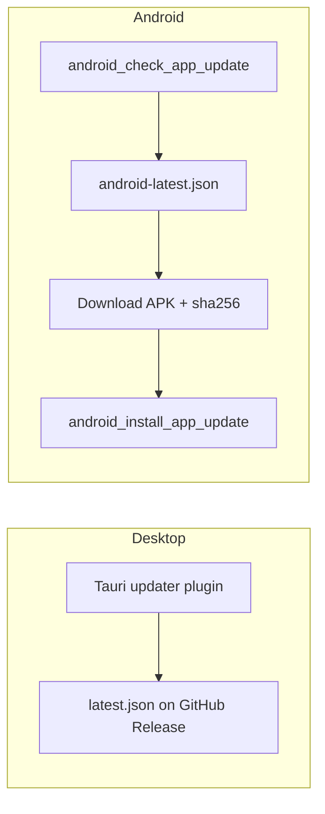

# Updater

Dual channels — do not mix manifests.

## Desktop

- Plugin registered only under `#[cfg(desktop)]` in `lib.rs`
- Endpoint / pubkey in `tauri.conf.json`; CI uploads updater JSON (`includeUpdaterJson`)
- Frontend: `tauriUpdater.ts` → `check` / `downloadAndInstall` / `relaunch`
- UI: `AppUpdateBanner.tsx`, Settings “Check for updates”
- Signing: `TAURI_SIGNING_PRIVATE_KEY` — see [[config-env]] / [[publish]]

## Android

- Core: `android_apk_update.rs` + Kotlin `ApkUpdatePlugin`
- Manifest URL points at release `android-latest.json` (platform `aarch64-linux-android`)
- Progress event: `android-update-download-progress`
- May need “install unknown apps” permission helpers
- No in-app relaunch after APK install (OS installer)

## Simulate (dev)

`?simulateUpdate=1` or `localStorage.tmSimulateUpdate = "1"` → fake available update; install is fake progress only (`platform.ts` → `isSimulateUpdateEnabled`).

## Pitfalls

- `.sig`, `latest.json`, and `android-latest.json` are not installers.
- Never point Android at desktop `latest.json`.
- Empty `TAURI_SIGNING_PRIVATE_KEY_PASSWORD` must not be stored as a GitHub secret.
