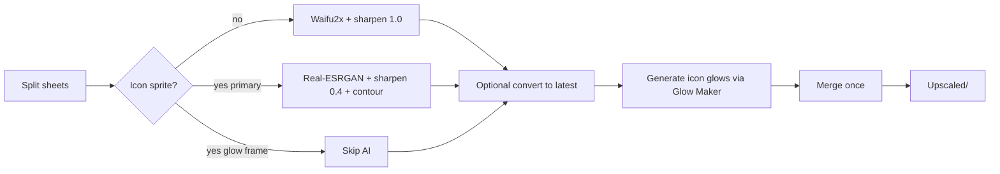
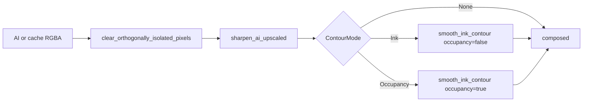

# Upscaler

Desktop-only batch tool (`upscaler` → `run_operation`). Android executor rejects it; binaries not in Android bundle.

| Layer | Path |
| --- | --- |
| Panel | `UpscalerToolPanel.tsx` |
| Domain | `UpscalerModel` / options in `domain/operations.ts` (default `waifu2x`) |
| Core | `core/upscaler.rs`, `upscaler_sidecar.rs`, `image_finish.rs` |
| Classification | `convert_to_new_version.rs` helpers (`is_icon_sprite_for_upscale`, …) |
| Cache | `core/sprite_index.rs` |

## Pipeline (high level)



UI `model` is the **gamesheet default**. Icons always force Real-ESRGAN AnimeVideo v3 even when the UI model is Waifu2x (`ai_model_for_sprite` / `ensure_upscaler_sidecars_ready`).

| Asset | Engine | Binary |
| --- | --- | --- |
| Gamesheets / non-icon | User/default (Waifu2x CUNet) | `waifu2x-ncnn-vulkan` |
| Icon primaries (+ bird/UFO capsules, extras) | Real-ESRGAN AnimeVideo v3 | `realesrgan-ncnn-vulkan` |
| Icon glow frames (`*_glow_*`) | Glow Maker from upscaled primary | **not** AI-upscaled |

Concurrency forced to 1. Real-ESRGAN CLI scale forced to native 4×; Waifu2x uses requested scale. Vulkan GPU probe prefers discrete; Windows Optimus pins exist in `main.rs` / sidecar.

## Icon-specific pipeline

Module comments and contracts: icons and bird/UFO capsule pieces use AnimeV3; glow is regenerated after AI, not upscaled.

### Which frames count as icons

`is_icon_sprite_for_upscale(relative_dir, frame_name, sheet_is_icon)`:

1. **Never** glow or fireboost frames (`is_glow_frame_name` / `is_fireboost_frame_name`) — those are not AI-routed.
2. Else if `is_icon_sprite` — under an `icons/` relative dir, or frame name parses as an icon id (player/ship/bird/ufo/…, excluding some legacy ids).
3. Else if the whole sheet was classified as an icon gamesheet (`sheet_is_icon_gamesheet` — dedicated icon atlases / custom Icon Editor sheets via plist format ratio).

Standalone PNGs can also hit the icon path via `standalone_uses_icon_pipeline` (icon id stem or `icon_stem_from_frame_name`, still excluding glow names).

### Per-sprite AI routing

```text
ai_model_for_sprite(...) =
  RealesrganAnime  if uses_icon_upscale_pipeline(...)
  else             default_model (UI / Waifu2x)
```

Both sidecars are resolved at run start when the UI default is Waifu2x, because icons still need AnimeV3.

### Post-AI finish (`image_finish`)

Applied after AI (and on some cache paths that still run finish) via `finish_upscaled_sprite_for_sheet` → `finish_ai_upscaled_sprite_layers`. Order is fixed:



`FinishPolicy::for_upscaled_sprite(is_icon, frame_name)` — `is_icon` is true when `ai_model_for_sprite` picked Real-ESRGAN (same predicate as the icon AI route):

| Kind | `sharpen_amount` | Contour |
| --- | --- | --- |
| Non-icon (gamesheet) | **1.0** (full) | `None` |
| Icon primary / secondary / capsule / etc. | **0.4** (gentler) | `Ink` |
| Icon `*_extra_001` only | **0.4** | `Occupancy` |

Important: icons get **weaker** unsharp than gamesheets, then **extra** contour AA. Gamesheets get strong edge sharpen and stop.

#### 1. Isolated-pixel cleanup (`image_alpha::clear_orthogonally_isolated_pixels`)

- Drops pixels with no 4-connected occupied neighbor (lone dots / diagonal-only specks).
- Zeroes RGB and alpha; canvas size unchanged (not a bbox crop).
- Shared with Glow Maker so transparent colored debris is not treated as occupied later.

#### 2. Sharpen (`sharpen_ai_upscaled`)

- Two-pass, **hard-edge-weighted** RGB unsharp (Gaussian σ≈0.5 + local 3×3 neighbor pass).
- Amount clamped 0..1; alpha untouched; pixels with alpha &lt; 8 skipped.
- Smooth gradients get low weight so they do not posterize/ring.
- True-black ink is **darken-only** (never lifted) so outline cores stay solid.

#### 3. Contour smooth + 1px AA (`smooth_ink_contour_with_mode`)

Only for icons (`Ink` / `Occupancy`). Gamesheets skip this.

- Builds a hard mask: **Ink** = near-black hard pixels (α≥128); **Occupancy** = any hard α≥128 (so white/light `*_extra_001` frames get holes treated like ink).
- Extracts outer contours + secondary holes; Laplacian-smooths with locked sharp corners (~55°).
- Rasterizes smoothed polys; punches holes so inner edges get the same AA as the silhouette.
- **Never invents coverage**; never touches white RGB; only reduces alpha on a ~1px fringe (then a follow-up pass may raise existing fringe alpha for AA).
- `is_icon_extra_frame`: file stem ends with `_extra_001` (case-insensitive, path-tolerant).

Debug helpers can write `.ai.png` / `.composed.png` layers (`save_icon_debug_layers`) during development paths.

### Icon glow generation (after AI / convert)

Glow frames are **replaced**, not upscaled. Reuses the same core as the Glow Maker tool (`render_icon_glow_from_primary` / `composite_icon_layers_for_glow`) — full algorithm: [[glow-maker]].

Upscaler-specific wiring:

1. Collect glow keys with `is_icon_glow_sprite`.
2. Map each glow → primary via `glow_primary_name_for`.
3. Composite layers when possible (`composite_layers: true` always for upscaler), else primary alone.
4. Options from UI: `glowThickness`, `glowTolerance`; `rainbow_glow: false`.
5. `remember_icon_primaries` + `sheet_upscale_order` so related legacy icon/glow sheets can share primaries.

### UI knobs that only affect icons

`UpscalerToolPanel`: glow line thickness + glow alpha threshold. Target HD/UHD and convert-to-latest apply to the whole run; model picker does **not** override icon AnimeV3 routing.

## Binaries and models

- Fetch: `npm run fetch:upscaler-binaries` (`scripts/fetch-upscaler-binaries.mjs`); also `--if-missing` via `npm run tauri`
- Land in `src-tauri/binaries/` + `src-tauri/resources/upscaler/`
- Declared in `tauri.conf.json` `bundle.externalBin` + resources
- Third-party notices: `resources/upscaler/NOTICE` (About links here)
- Android CI uses `npx tauri` and skips the npm fetch wrapper on purpose

## Sprite-index reuse

Exact hash and loose similarity avoid re-running AI on known sprites. Regenerate index from Settings when game files change. Cached icon sprites still go through icon finish / glow regeneration as needed by the pipeline.

## Pitfalls

- First Upscaler run without fetch fails until **both** Waifu2x and Real-ESRGAN sidecars exist (icons always need AnimeV3).
- Do not AI-upscale `*_glow_*` frames — Glow Maker owns them after primaries are done.
- Do not collapse to one engine without a product decision.
- Optional “copy missing from newest game” needs a found GD install with Resources.
- Multi-part icons need layer composite before glow; glowing a single capsule alone is wrong.
